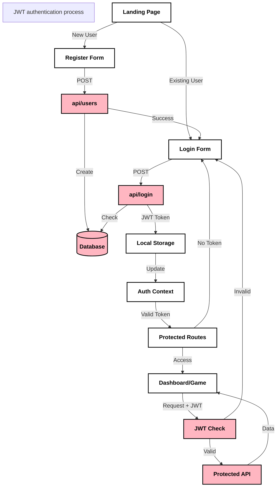
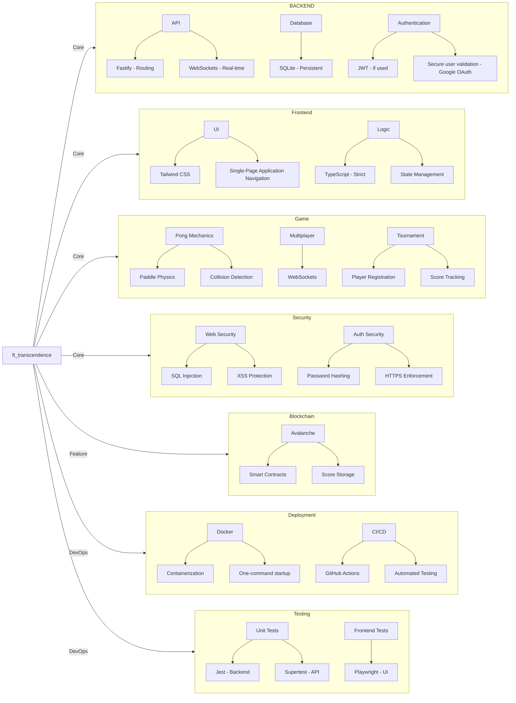
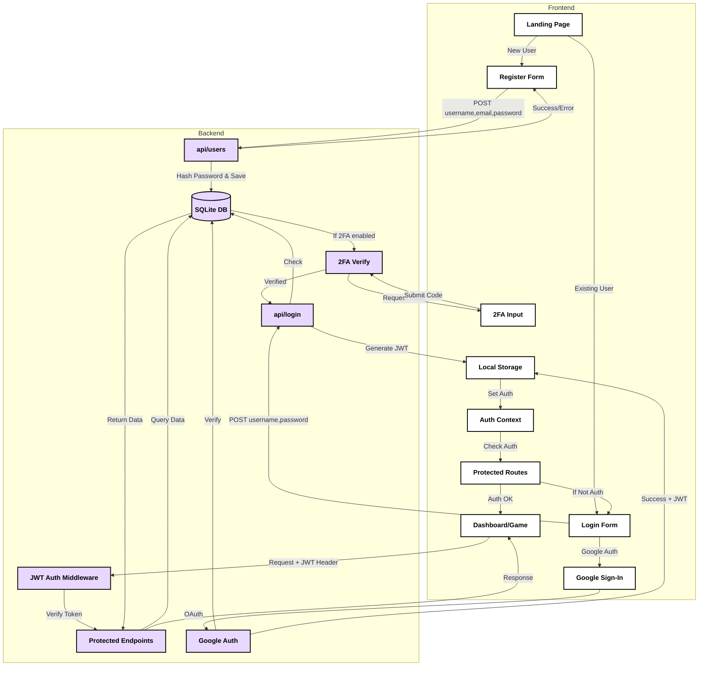

# ft_transcendence

## Overview

ft_transcendence is a web-based multiplayer Pong game that integrates real-time gameplay with modern web technologies. Developed as part of our Hive Helsinki project, it pushes us to adapt to new technologies and implement a secure, scalable, and interactive application.

## Team

We are a team of five developers working together to complete this project within a two-month timeframe (01.04 - 01.06). Our focus is on designing an engaging gaming experience while ensuring security and performance best practices.

### Developers
- [Miyuki Ito](https://github.com/ito-miyuki)
- [Kim Matjuhin](https://github.com/k2matu)
- [Valle Vaalanti](https://github.com/Vallehtelia)
- [Oliver Hertzberg](https://github.com/oliverhertzberg)
- [Lumi Kilpeläinen](https://github.com/lkilpela)
  
## Features

- 🎮 Pong gameplay: Play 1v1 Pong matches & multiplayers locally.

- 🔐 User management: Registration, authentication, and user profiles.

- 🏆 Tournament system: Matchmaking, leaderboards, and competitive play.

- 🛡️ Security: HTTPS enforcement, input validation, hashed passwords, and protection against SQL injection and XSS.

- 🐳 Dockerized deployment: Easy setup with a single command.

- 🚀 Custom modules: Additional features like AI opponents, chat functionality, and enhanced accessibility.

## Chosen Modules

### Web

- ✅ Major: Use a framework to build the backend.

- ✅ Minor: Use a framework or toolkit to build the frontend.

- ✅ Minor: Use a database for the backend.

- ✅ Major: Store the score of a tournament in the Blockchain.

### User Management

- ✅ Major: Standard user management, authentication, users across tournaments.

- ✅ Major: Implementing remote authentication.

### Gameplay & User Experience

- ✅ Major: Multiplayer (more than 2 players in the same game).

- ✅ Major: Add another game with user history and matchmaking.

- 🎯 Nice to Have: Live chat.

### Cybersecurity

- ✅ Major: Implement Two-Factor Authentication (2FA) and JWT.

### Accessibility

- ✅ Minor: Expanding browser compatibility.

- ✅ Minor: Supports multiple languages.

### Mindmap

## Technology Stack

- Frontend: TypeScript with Tailwind CSS & React

- Backend: Fastify with Node.js

- Database: SQLite

- Containerization: Docker

- Security: HTTPS, JWT authentication, and secure storage of credentials.

## Installation & Setup

- Access the application via http://localhost:xxxx/. (FINAL PORT TO BE CONFIRMED)

## Project Structure

### Development Guidelines

- Follow the coding standards and best practices.

- Use Git for version control with meaningful commit messages.

- Ensure the project remains secure and compliant.

- Contributions should be peer-reviewed before merging.

### Roadmap
Phase | Tasks
-- | --
Week 1-2 | Initial setup, project planning, and architecture decisions
Week 3-4 | Core game mechanics, authentication, and database integration
Week 5-6 | Enhancing gameplay, additional features, and security implementation
Week 7-8 | Testing, debugging, and final deployment

## Authentication System Architecture
- JWT Authentication
- Two-Factor Authentication (2FA)
- Google OAuth Integration

