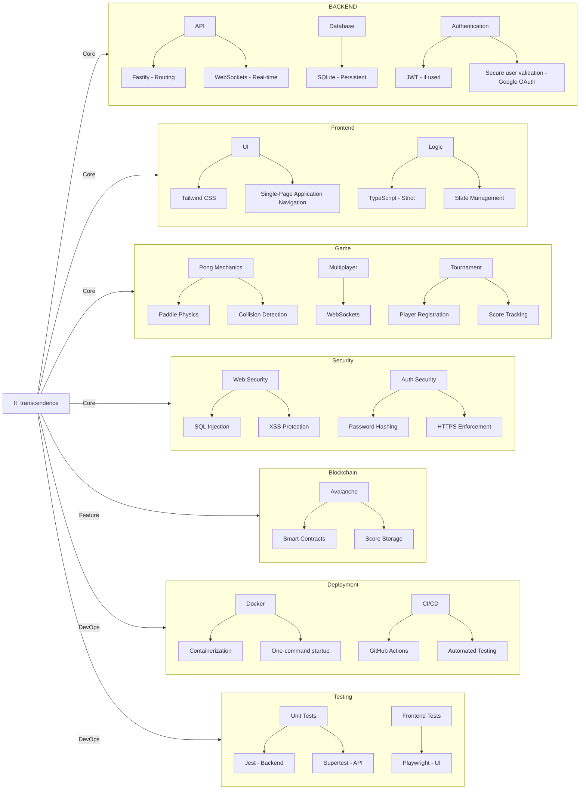

```mermaid
graph LR

  A[ft_transcendence] -->|Core| B[BACKEND]
  A -->|Core| C[Frontend]
  A -->|Core| D[Game]
  A -->|Core| E[Security]
  A -->|Feature| F[Blockchain]
  A -->|DevOps| G[Deployment]
  A -->|DevOps| H[Testing]

  subgraph B [BACKEND]
    B1[API] --> B1a[Fastify - Routing]
    B1 --> B1b[WebSockets - Real-time]
    B2[Database] --> B2a[SQLite - Persistent]
    B3[Authentication] --> B3a[JWT - if used]
    B3 --> B3b[Secure user validation - Google OAuth]
  end

  subgraph C [Frontend]
    C1[UI] --> C1a[Tailwind CSS]
    C1 --> C1b[Single-Page Application Navigation]
    C2[Logic] --> C2a[TypeScript - Strict] 
    C2 --> C2b[State Management]
  end

  subgraph D [Game]
    D1[Pong Mechanics] --> D1a[Paddle Physics]
    D1 --> D1b[Collision Detection]
    D2[Multiplayer] --> D2a[WebSockets]
    D3[Tournament] --> D3a[Player Registration]
    D3 --> D3b[Score Tracking]
  end

  subgraph E [Security]
    E1[Web Security] --> E1a[SQL Injection]
    E1 --> E1b[XSS Protection]
    E2[Auth Security] --> E2a[Password Hashing]
    E2 --> E2b[HTTPS Enforcement]
  end

  subgraph F [Blockchain]
    F1[Avalanche] --> F1a[Smart Contracts]
    F1 --> F1b[Score Storage]
  end

  subgraph G [Deployment]
    G1[Docker] --> G1a[Containerization]
    G1 --> G1b[One-command startup]
    G2[CI/CD] --> G2a[GitHub Actions]
    G2 --> G2b[Automated Testing]
  end

  subgraph H [Testing]
    H1[Unit Tests] --> H1a[Jest - Backend]
    H1 --> H1b[Supertest - API]
    H2[Frontend Tests] --> H2a[Playwright - UI]
  end

```
