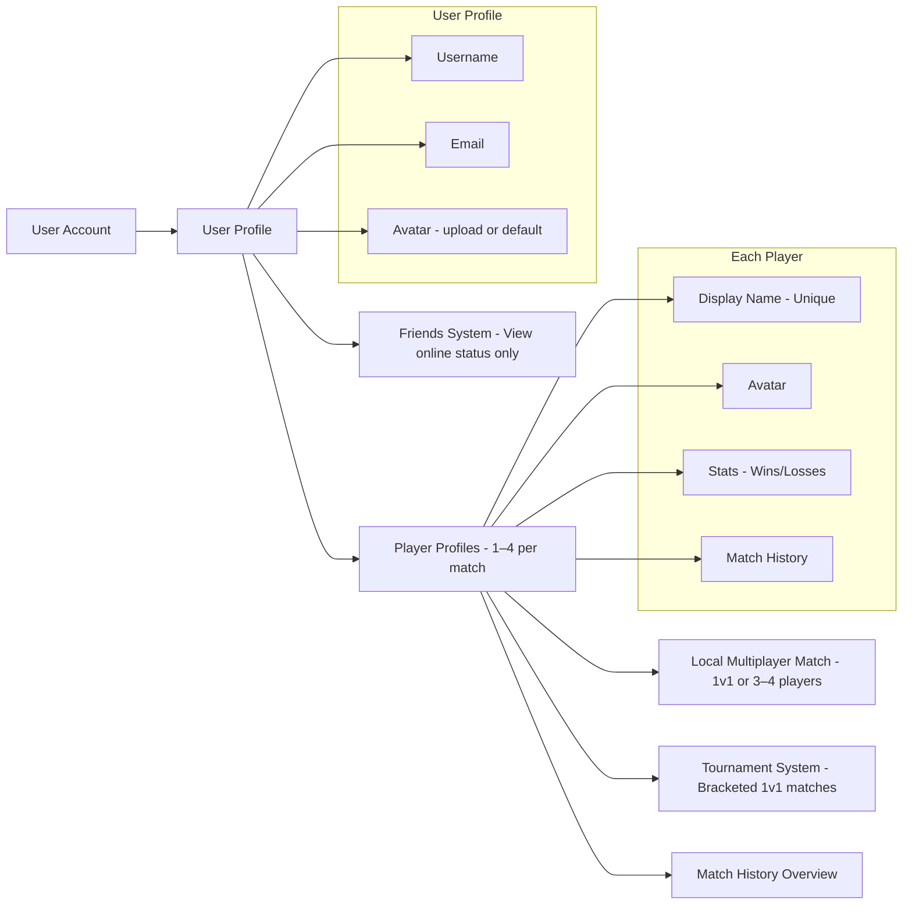

```mermaid
graph LR
  A[User Account] --> B[User Profile]
  B --> C[Player Profiles - 1–4 per match]
  C --> D[Local Multiplayer Match - 1v1 or 3–4 players]
  C --> E[Tournament System - Bracketed 1v1 matches]
  C --> F[Match History Overview]
  B --> G[Friends System - View online status only]

  subgraph "User Profile"
    B1[Username]
    B2[Email]
    B3[Avatar - upload or default]
  end

  subgraph "Each Player"
    C1[Display Name - Unique]
    C2[Avatar]
    C3[Stats - Wins/Losses]
    C4[Match History]
  end

  B --> B1
  B --> B2
  B --> B3

  C --> C1
  C --> C2
  C --> C3
  C --> C4
```